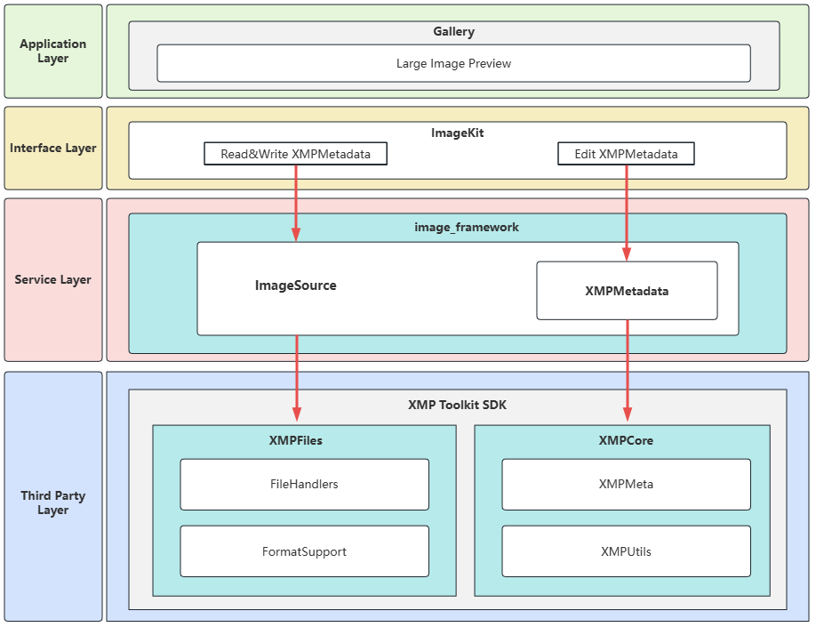

# xmp_toolkit_sdk

Upstream repository: https://github.com/adobe/xmp-toolkit-sdk

This repository contains the third-party open-source software XMP Toolkit SDK (Adobe XMP Toolkit SDK), used to parse, read, write, and serialize XMP (Extensible Metadata Platform) metadata.

In OpenHarmony, `xmp_toolkit_sdk` mainly serves as a foundational component of the multimedia subsystem, providing XMP metadata read/write capabilities for media files such as images.

## OpenHarmony Integration Architecture Diagram



## Directory Structure

```
build/              Build helper scripts
docs/               Documentation (including API docs, technical notes, etc.)
public/             Public headers and related wrappers (for upper-layer components)
samples/            Official sample code
source/             Toolkit adaptation and platform-specific implementations (e.g., IO adapter, Host/Expat adapter)
third-party/        Third-party dependencies (expat, zlib)
tools/              Auxiliary tools and scripts
XMPCommon/          Common base module (generic interfaces, error codes, utilities, etc.)
XMPCore/            Core DOM/metadata model implementation
XMPFiles/           XMP read/write implementation for file formats (handles XMP packets by file type)
XMPFilesPlugins/    XMPFiles plugins (enable/build as needed)
README.md           README
```


## How Developers Use It

### Device Developers

#### Feature Customization Instructions

`xmp_toolkit_sdk` is a **mandatory feature** for the OpenHarmony system and does not involve feature customization processing. System components only need to be introduced following the standard process, without additional configuration or cropping.

#### System Component Integration Steps

This repo is located at `//third_party/xmp_toolkit_sdk` and is used for system components to link XMP Toolkit SDK at build time.

**Step 1: Add external dependency in the consumer's `bundle.json`**

Using Image Framework as an example, the file path is `//foundation/multimedia/image_framework/bundle.json`.

```json
 "deps": {
        "components": [
          "xmp_toolkit_sdk"
        ]
}
```

**Step 2: Add dependency in the consumer's `BUILD.gn`**

Using Image Framework as an example, add it in `//foundation/multimedia/image_framework/interfaces/innerkits/BUILD.gn`.

```gn
external_deps += [ "xmp_toolkit_sdk:xmpsdk" ]
```

Note: The build artifact of `xmp_toolkit_sdk` is `libxmpsdk.so`, which is a **dynamic library dependency**. It is typically loaded automatically by the dynamic linker when the process starts, and the business side does not need to explicitly call `dlopen`.

#### Read/Write XMP Metadata Using `xmp_toolkit_sdk`

The following examples are primarily based on the native C++ APIs of XMP Toolkit SDK and demonstrate a typical workflow of “open file, read XMP, modify properties, and write back to the file”.

(1) Initialize the global state of XMP Toolkit.

  ```cpp
  // XMPMeta
  static bool SXMPMeta::Initialize();
  static void SXMPMeta::Terminate();

  // XMPFiles
  static bool SXMPFiles::Initialize(XMP_OptionBits options = 0);
  static void SXMPFiles::Terminate();
  ```

(2) Open a file and read XMP.

  ```cpp
  bool SXMPFiles::OpenFile(XMP_StringPtr filePath,
                           XMP_FileFormat format = kXMP_UnknownFile,
                           XMP_OptionBits openFlags = 0);

  bool SXMPFiles::GetXMP(SXMPMeta *xmpObj = 0,
                         tStringObj *xmpPacket = 0,
                         XMP_PacketInfo *packetInfo = 0);
  ```

  A concrete example:

  ```cpp
  #include "XMP.hpp"
  #include "XMP.incl_cpp"

  SXMPMeta xmp;
  SXMPFiles xmpFiles;

  SXMPMeta::Initialize();
  SXMPFiles::Initialize(kXMPFiles_IgnoreLocalText);

  const char *filePath = "/data/test.jpg";
  const XMP_OptionBits openFlags = kXMPFiles_OpenForRead;
  if (xmpFiles.OpenFile(filePath, kXMP_UnknownFile, openFlags)) {
      if (xmpFiles.GetXMP(&xmp)) {
          // Read success
      }
      xmpFiles.CloseFile();
  }

  SXMPFiles::Terminate();
  SXMPMeta::Terminate();
  ```

(3) Get/Set/Delete XMP properties.

  ```cpp
  void SXMPMeta::SetProperty(XMP_StringPtr schemaNS,
                             XMP_StringPtr propName,
                             XMP_StringPtr propValue,
                             XMP_OptionBits options = 0);

  bool SXMPMeta::GetProperty(XMP_StringPtr schemaNS,
                             XMP_StringPtr propName,
                             tStringObj *propValue,
                             XMP_OptionBits *options) const;

  void SXMPMeta::DeleteProperty(XMP_StringPtr schemaNS,
                                XMP_StringPtr propName);
  ```

  A concrete example:

  ```cpp
  std::string value;
  XMP_OptionBits options = kXMP_NoOptions;

  // Use Dublin Core as an example
  const char *schemaNS = kXMP_NS_DC;
  const char *propName = "title";

  xmp.SetProperty(schemaNS, propName, "example_title", kXMP_NoOptions);
  if (xmp.GetProperty(schemaNS, propName, &value, &options)) {
      // value: "example_title"
  }
  xmp.DeleteProperty(schemaNS, propName);
  ```

(4) Serialize/Deserialize XMP (RDF/XML).

  ```cpp
  void SXMPMeta::ParseFromBuffer(XMP_StringPtr buffer,
                                 XMP_StringLen bufferSize,
                                 XMP_OptionBits options = 0);

  void SXMPMeta::SerializeToBuffer(tStringObj *rdfString,
                                   XMP_OptionBits options = 0,
                                   XMP_StringLen padding = 0) const;
  ```

  A concrete example:

  ```cpp
  std::string rdf;
  xmp.SerializeToBuffer(&rdf, kXMP_OmitPacketWrapper);

  SXMPMeta parsed;
  parsed.ParseFromBuffer(rdf.c_str(), static_cast<XMP_StringLen>(rdf.size()));
  ```

(5) Write back to the file and close.

  ```cpp
bool SXMPFiles::CanPutXMP(const SXMPMeta &xmpObj);
void SXMPFiles::PutXMP(const SXMPMeta &xmpObj);
void SXMPFiles::CloseFile(XMP_OptionBits closeFlags = 0);
  ```

  A concrete example:

  ```cpp
const XMP_OptionBits updateFlags = kXMPFiles_OpenForUpdate;
if (xmpFiles.OpenFile(filePath, kXMP_UnknownFile, updateFlags)) {
    // GetXMP -> Modify xmp -> PutXMP
    if (xmpFiles.GetXMP(&xmp)) {
        xmp.SetProperty(kXMP_NS_XMP, "CreatorTool", "OpenHarmony", kXMP_NoOptions);
        if (xmpFiles.CanPutXMP(xmp)) {
            xmpFiles.PutXMP(xmp);
        }
    }
    xmpFiles.CloseFile();
}
  ```

### Application Developers

The C++ APIs of XMP Toolkit SDK are not directly exposed to third-party applications.

For application developers, some image-related XMP capabilities are provided by the Image Framework subsystem as public APIs. Typical capabilities include:

- **Read image XMP metadata**: read an XMP metadata object from an image source
- **Write image XMP metadata**: write XMP metadata back to an image source
- **Read/Set/Delete XMP tags by path**: such as `xmp:title`
- **Enumerate/batch-get XMP tags**: traverse tags under a specified root path
- **Read/Write XMP in binary form**: get a blob or overwrite using a blob
- **Register namespaces and prefixes**: register a namespace before operating on custom tags

#### API Examples

Typical API examples (APIs provided by Image Framework for application developers; snippets are simplified):

**1) Read image XMP metadata**

API prototype: `readXMPMetadata(): Promise<XMPMetadata | null>;`

Example Demo:

```ts
import { image } from '@kit.ImageKit';

const imageSource: image.ImageSource = image.createImageSource(filePath);
const xmpMetadata: image.XMPMetadata | null = await imageSource.readXMPMetadata();
```

**2) Write image XMP metadata**

API prototype: `writeXMPMetadata(xmpMetadata: XMPMetadata): Promise<void>;`

Example Demo:

```ts
import { image } from '@kit.ImageKit';

const imageSource: image.ImageSource = image.createImageSource(filePath);
let xmpMetadata = new image.XMPMetadata();
await xmpMetadata.setValue('xmp:title', image.XMPTagType.SIMPLE, 'My Title');
await imageSource.writeXMPMetadata(xmpMetadata);
```

**3) Register namespace prefix**

API prototype: `registerNamespacePrefix(xmlns: string, prefix: string): Promise<void>;`

Example Demo:

```ts
import { image } from '@kit.ImageKit';

const xmpMetadata = new image.XMPMetadata();
await xmpMetadata.registerNamespacePrefix('http://mybook.com/story/1.0/', 'book');
```

**4) Set tag by path**

API prototype: `setValue(path: string, type: XMPTagType, value?: string): Promise<void>;`

Example Demo:

```ts
import { image } from '@kit.ImageKit';

await xmpMetadata.setValue('xmp:title', image.XMPTagType.SIMPLE, 'My Title');
```

**5) Read tag by path**

API prototype: `getTag(path: string): Promise<XMPTag | null>;`

Example Demo:

```ts
import { image } from '@kit.ImageKit';

const tag: image.XMPTag | null = await xmpMetadata.getTag('xmp:title');
```

**6) Enumerate tags**

API prototype: `enumerateTags(callback: (path: string, tag: XMPTag) => boolean, rootPath?: string, options?: XMPEnumerateOption): void;`

Example Demo:

```ts
import { image } from '@kit.ImageKit';

xmpMetadata.enumerateTags((path: string, tag: image.XMPTag): boolean => {
  console.info(`path=${path}, value=${tag.value}`);
  return false;
}, undefined, { isRecursive: true });
```

**7) Read/Write XMP in binary form**

API prototypes:

+ Binary read: `getBlob(): Promise<ArrayBuffer>;`
+ Binary write: `setBlob(buffer: ArrayBuffer): Promise<void>;`

Example Demo:

```ts
const blob: ArrayBuffer = await xmpMetadata.getBlob();
await xmpMetadata.setBlob(blob);
```

For more API definitions, supported formats, detailed specifications, and error codes, refer to the Image Framework documentation.

#### Typical Scenario Examples

**Scenario 1: Read title information for display (read)**

Applicable scenarios: Display title/description on media details pages; or extract key fields when building indexes.

```ts
import { image } from '@kit.ImageKit';

async function readXMPTitle(filePath: string) {
  const imageSource: image.ImageSource = image.createImageSource(filePath);
  const xmpMetadata: image.XMPMetadata | null = await imageSource.readXMPMetadata();
  if (xmpMetadata) {
    const titleTag: image.XMPTag | null = await xmpMetadata.getTag('xmp:title');
    if (titleTag) {
      console.info(`xmp:title=${titleTag.value}`);
    }
  }
}
```

**Scenario 2: Edit and save metadata (read-modify-write)**

Applicable scenarios: After users modify title/description/author information in an editing page, persist it to the image file.

```ts
import { image } from '@kit.ImageKit';

async function editAndSaveXMP(filePath: string) {
  const imageSource: image.ImageSource = image.createImageSource(filePath);
  let xmpMetadata: image.XMPMetadata | null = await imageSource.readXMPMetadata();
  if (!xmpMetadata) {
    xmpMetadata = new image.XMPMetadata();
  }

  await xmpMetadata.setValue('xmp:title', image.XMPTagType.SIMPLE, 'My Title');
  await xmpMetadata.setValue('xmp:CreatorTool', image.XMPTagType.SIMPLE, 'OpenHarmony');
  await imageSource.writeXMPMetadata(xmpMetadata);
}
```

**Scenario 3: Write business custom fields (custom namespace)**

Applicable scenarios: Business needs to write custom fields (e.g., content source, classification, audit results), avoiding conflicts with standard XMP namespaces.

```ts
import { image } from '@kit.ImageKit';

async function writeCustomXMP(filePath: string) {
  const imageSource: image.ImageSource = image.createImageSource(filePath);
  let xmpMetadata: image.XMPMetadata | null = await imageSource.readXMPMetadata();
  if (!xmpMetadata) {
    xmpMetadata = new image.XMPMetadata();
  }

  await xmpMetadata.registerNamespacePrefix('http://mybook.com/story/1.0/', 'book');
  await xmpMetadata.setValue('book:chapter', image.XMPTagType.SIMPLE, '1');
  await xmpMetadata.setValue('book:source', image.XMPTagType.SIMPLE, 'imported');
  await imageSource.writeXMPMetadata(xmpMetadata);
}
```

## Feature Support

The `xmp_toolkit_sdk` integrated in OpenHarmony provides XMP metadata read/write capabilities, mainly for common image formats such as JPEG, PNG, GIF (the actual supported scope depends on the integration and build configuration).

## Other Third-Party Dependencies

The main external dependencies of `xmp_toolkit_sdk` in OpenHarmony are as follows:

- **expat**
  - **Dependency function**: XML parsing. 
  - **Usage location**: XML/RDF parsing adaptation layer of XMPCore (e.g., `XMPCore/source/ExpatAdapter.cpp` includes `expat.h`, parsing XMP RDF/XML via APIs such as `XML_ParserCreateNS`, `XML_Parse`).

- **zlib**
  - **Dependency function**: compression/decompression (deflate/inflate).
  - **Usage location**: Used by XMPFiles when handling some data wrapped in compressed form (e.g., `XMPFiles/source/FormatSupport/SWF_Support.cpp`, `XMPFiles/source/FileHandlers/UCF_Handler.cpp`, etc. include `zlib.h` and call `inflate/deflate`).

## License

`xmp_toolkit_sdk` uses the open-source license corresponding to Adobe XMP Toolkit SDK. See the `LICENSE` file in the repository root directory.