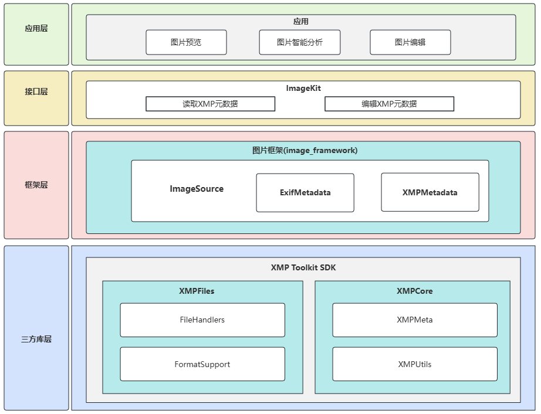

# xmp_toolkit_sdk

原始仓库来源：https://github.com/adobe/xmp-toolkit-sdk

仓库包含第三方开源软件 XMP Toolkit SDK（Adobe XMP Toolkit SDK），用于解析、读取、写入和序列化 XMP（Extensible Metadata Platform）元数据。

在 OpenHarmony 中，xmp_toolkit_sdk 主要作为媒体子系统的基础组件，为图片等媒体文件提供 XMP 元数据的读写能力。

## OpenHarmony集成架构图



## 目录结构

```
build/              构建辅助脚本
docs/               说明文档（包含 API 文档、技术说明等）
public/             对外发布头文件及相关封装（供上层组件引用）
samples/            官方示例代码
source/             工具包适配与平台相关实现（如 IO 适配、Host/Expat 适配等）
third-party/        第三方依赖（expat、zlib）
tools/              辅助工具与脚本
XMPCommon/          XMP 公共基础模块（通用接口、错误码、工具类等）
XMPCore/            XMP 核心 DOM/元数据模型实现
XMPFiles/           面向文件格式的 XMP 读写实现（按文件类型处理 XMP 包）
XMPFilesPlugins/    XMPFiles 插件相关内容（按需启用/构建）
README.md           README 说明
```


## 开发者如何使用

### 设备开发者

#### 系统组件引入xmp_toolkit_sdk步骤

本仓位于`//third_party/xmp_toolkit_sdk`，用于系统组件在编译期链接 XMP Toolkit SDK。

系统组件依赖步骤：

1. 在使用方的`bundle.json`中添加外部依赖:

   以图片框架为例，文件路径为`//foundation/multimedia/image_framework/bundle.json`。

   ```
    "deps": {
           "components": [
             "xmp_toolkit_sdk"
           ]
   }
   ```

2. 在使用方的`BUILD.gn`中添加依赖：

   以图片框架为例，添加位置为`//foundation/multimedia/image_framework/interfaces/innerkits/BUILD.gn`。

   ```
   external_deps += [ "xmp_toolkit_sdk:xmpsdk" ]
   ```

备注：`xmp_toolkit_sdk`构建产物为`libxmpsdk.so`，属于**动态库依赖**，通常由动态链接器随进程启动自动加载，无需业务侧显式`dlopen`。

#### 使用xmp_toolkit_sdk读写xmp元数据

以下示例以 XMP Toolkit SDK 的原生 C++ 接口为主，展示典型的“打开文件、读取 XMP、修改属性、写回文件”的流程。

(1) 初始化 XMP Toolkit 的全局状态。

  ```
  // XMPMeta
  static bool SXMPMeta::Initialize();
  static void SXMPMeta::Terminate();

  // XMPFiles
  static bool SXMPFiles::Initialize(XMP_OptionBits options = 0);
  static void SXMPFiles::Terminate();
  ```

(2) 打开文件并读取 XMP。

  ```
  bool SXMPFiles::OpenFile(XMP_StringPtr filePath,
                           XMP_FileFormat format = kXMP_UnknownFile,
                           XMP_OptionBits openFlags = 0);

  bool SXMPFiles::GetXMP(SXMPMeta *xmpObj = 0,
                         tStringObj *xmpPacket = 0,
                         XMP_PacketInfo *packetInfo = 0);
  ```

  具体示例如：

  ```cpp
  #include "XMP.hpp"
  #include "XMP.incl_cpp"

  SXMPMeta xmp;
  SXMPFiles xmpFiles;

  SXMPMeta::Initialize();
  SXMPFiles::Initialize(kXMPFiles_IgnoreLocalText);

  const char *filePath = "/data/test.jpg";
  const XMP_OptionBits openFlags = kXMPFiles_OpenForRead;
  if (xmpFiles.OpenFile(filePath, kXMP_UnknownFile, openFlags)) {
      if (xmpFiles.GetXMP(&xmp)) {
          // Read success
      }
      xmpFiles.CloseFile();
  }

  SXMPFiles::Terminate();
  SXMPMeta::Terminate();
  ```

(3) 读取/设置/删除 XMP 属性。

  ```
  void SXMPMeta::SetProperty(XMP_StringPtr schemaNS,
                             XMP_StringPtr propName,
                             XMP_StringPtr propValue,
                             XMP_OptionBits options = 0);

  bool SXMPMeta::GetProperty(XMP_StringPtr schemaNS,
                             XMP_StringPtr propName,
                             tStringObj *propValue,
                             XMP_OptionBits *options) const;

  void SXMPMeta::DeleteProperty(XMP_StringPtr schemaNS,
                                XMP_StringPtr propName);
  ```

  具体示例如：

  ```cpp
  std::string value;
  XMP_OptionBits options = kXMP_NoOptions;

  // 以 Dublin Core 为例
  const char *schemaNS = kXMP_NS_DC;
  const char *propName = "title";

  xmp.SetProperty(schemaNS, propName, "example_title", kXMP_NoOptions);
  if (xmp.GetProperty(schemaNS, propName, &value, &options)) {
      // value: "example_title"
  }
  xmp.DeleteProperty(schemaNS, propName);
  ```

(4) 序列化/反序列化 XMP（RDF/XML）。

  ```
  void SXMPMeta::ParseFromBuffer(XMP_StringPtr buffer,
                                 XMP_StringLen bufferSize,
                                 XMP_OptionBits options = 0);

  void SXMPMeta::SerializeToBuffer(tStringObj *rdfString,
                                   XMP_OptionBits options = 0,
                                   XMP_StringLen padding = 0) const;
  ```

  具体示例如：

  ```cpp
  std::string rdf;
  xmp.SerializeToBuffer(&rdf, kXMP_OmitPacketWrapper);

  SXMPMeta parsed;
  parsed.ParseFromBuffer(rdf.c_str(), static_cast<XMP_StringLen>(rdf.size()));
  ```

(5) 写回文件并关闭。

  ```
bool SXMPFiles::CanPutXMP(const SXMPMeta &xmpObj);
void SXMPFiles::PutXMP(const SXMPMeta &xmpObj);
void SXMPFiles::CloseFile(XMP_OptionBits closeFlags = 0);
  ```

  具体示例如：

  ```cpp
const XMP_OptionBits updateFlags = kXMPFiles_OpenForUpdate;
if (xmpFiles.OpenFile(filePath, kXMP_UnknownFile, updateFlags)) {
    // GetXMP -> Modify xmp -> PutXMP
    if (xmpFiles.GetXMP(&xmp)) {
        xmp.SetProperty(kXMP_NS_XMP, "CreatorTool", "OpenHarmony", kXMP_NoOptions);
        if (xmpFiles.CanPutXMP(xmp)) {
            xmpFiles.PutXMP(xmp);
        }
    }
    xmpFiles.CloseFile();
}
  ```

### 应用开发者

XMP Toolkit SDK 的 C++ 接口不直接对三方应用开放。

对于应用开发者，部分与图片相关的 XMP 能力由图片框架子系统对外提供接口，典型能力包括：

- **读取图片 XMP 元数据**：从图片源读取 XMP 元数据对象
- **写入图片 XMP 元数据**：将 XMP 元数据写回图片源
- **按路径读取/设置/删除 XMP 标签**：如`xmp:title`等
- **枚举/批量获取 XMP 标签**：遍历指定根路径下标签
- **二进制形式读取/写入XMP**：获取 blob 或使用 blob 覆盖
- **注册命名空间与前缀**：在操作自定义标签前注册命名空间

典型接口示例（图片框架对应用开发者提供的 API，示例为精简片段）：

**1) 读取图片 XMP 元数据**

接口原型：`readXMPMetadata(): Promise<XMPMetadata | null>;`

示例Demo：

```
import { image } from '@kit.ImageKit';

const imageSource: image.ImageSource = image.createImageSource(filePath);
const xmpMetadata: image.XMPMetadata | null = await imageSource.readXMPMetadata();
```

**2) 写入图片 XMP 元数据**

接口原型：`writeXMPMetadata(xmpMetadata: XMPMetadata): Promise<void>;`

示例Demo：

```
import { image } from '@kit.ImageKit';

const imageSource: image.ImageSource = image.createImageSource(filePath);
let xmpMetadata = new image.XMPMetadata();
await xmpMetadata.setValue('xmp:title', image.XMPTagType.SIMPLE, 'My Title');
await imageSource.writeXMPMetadata(xmpMetadata);
```

**3) 注册命名空间前缀**

接口原型：`registerNamespacePrefix(xmlns: string, prefix: string): Promise<void>;`

示例Demo：

```
import { image } from '@kit.ImageKit';

const xmpMetadata = new image.XMPMetadata();
await xmpMetadata.registerNamespacePrefix('http://mybook.com/story/1.0/', 'book');
```

**4) 按路径设置标签**

接口原型：`setValue(path: string, type: XMPTagType, value?: string): Promise<void>;`

示例Demo：

```
import { image } from '@kit.ImageKit';

await xmpMetadata.setValue('xmp:title', image.XMPTagType.SIMPLE, 'My Title');
```

**5) 按路径读取标签**

接口原型：`getTag(path: string): Promise<XMPTag | null>;`

示例Demo：

```
import { image } from '@kit.ImageKit';

const tag: image.XMPTag | null = await xmpMetadata.getTag('xmp:title');
```

**6) 枚举标签**

接口原型：`enumerateTags(callback: (path: string, tag: XMPTag) => boolean, rootPath?: string, options?: XMPEnumerateOption): void;`

示例Demo：

```
import { image } from '@kit.ImageKit';

xmpMetadata.enumerateTags((path: string, tag: image.XMPTag): boolean => {
  console.info(`path=${path}, value=${tag.value}`);
  return false;
}, undefined, { isRecursive: true });
```

**7) 以二进制形式读取/写入XMP**

接口原型：

+ 按二进制读取：`getBlob(): Promise<ArrayBuffer>;`

+ 按二进制写入：`setBlob(buffer: ArrayBuffer): Promise<void>;`

示例Demo：

```
const blob: ArrayBuffer = await xmpMetadata.getBlob();
await xmpMetadata.setBlob(blob);
```

更多接口定义、支持格式、详细规格与错误码请参考图片框架相关文档。

## 功能支持说明

OpenHarmony 集成的 xmp_toolkit_sdk 用于提供 XMP 元数据的读写能力，主要面向 JPEG、PNG、GIF 等常见图片格式（具体支持范围以实际接入与编译配置为准）。

## 其它三方依赖说明

xmp_toolkit_sdk 在 OpenHarmony 中的主要外部依赖如下：

- **expat**
  - **依赖功能**：XML 解析。
  - **使用位置**：XMPCore 的 XML/RDF 解析适配层（如`XMPCore/source/ExpatAdapter.cpp`包含`expat.h`，通过`XML_ParserCreateNS`、`XML_Parse`等接口解析 XMP RDF/XML）。

- **zlib**
  - **依赖功能**：压缩/解压（deflate/inflate）。
  - **使用位置**：XMPFiles 在处理部分包含压缩封装的数据时使用（例如`XMPFiles/source/FormatSupport/SWF_Support.cpp`、`XMPFiles/source/FileHandlers/UCF_Handler.cpp`等包含`zlib.h`并调用`inflate/deflate`）。

## License

xmp_toolkit_sdk 使用 Adobe XMP Toolkit SDK 对应的开源协议，详见仓库根目录下的 `LICENSE` 文件。